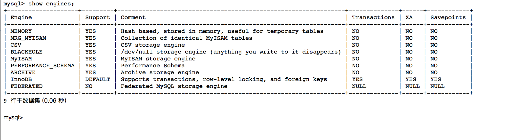

#Mysql 数据库引擎
##数据库引擎
MySql区别于其它数据库系统的一个重要特点是支持插入式存储引擎。
数据库引擎是用于存储、处理和保护数据的核心服务。利用数据库引擎可控制访问权限并快速处理事务，从而满足企业内大多数需要处理大量数据的应用程序的要求。 使用数据库引擎创建用于联机事务处理或联机分析处理数据的关系数据库。这包括创建用于存储数据的表和用于查看、管理和保护数据安全的数据库对象（如索引、视图和存储过程）。

存储引擎说白了就是如何存储数据、如何为存储的数据建立索引和如何更新、查询数据等技术的实现方法。因为在关系数据库中数据的存储是以表的形式存储的，所以存储引擎也可以称为表类型（即存储和操作此表的类型）。
    在Oracle 和SQL Server等数据库中只有一种存储引擎，所有数据存储管理机制都是一样的。而MySql数据库提供了多种存储引擎。用户可以根据不同的需求为数据表选择不同的存储引擎，用户也可以根据自己的需要编写自己的存储引擎。
##MySQL数据库引擎类别

###MyISAM
这种引擎是mysql最早提供的。这种引擎又可以分为静态MyISAM、动态MyISAM 和压缩MyISAM三种：

* **静态MyISAM**：如果数据表中的各数据列的长度都是预先固定好的，服务器将自动选择这种表类型。因为数据表中每一条记录所占用的空间都是一样的，所以这种表存取和更新的效率非常高。当数据受损时，恢复工作也比较容易做。
* **动态MyISAM**：如果数据表中出现varchar、xxxtext或xxxBLOB字段时，服务器将自动选择这种表类型。相对于静态MyISAM，这种表存储空间比较小，但由于每条记录的长度不一，所以多次修改数据后，数据表中的数据就可能离散的存储在内存中，进而导致执行效率下降。同时，内存中也可能会出现很多碎片。因此，这种类型的表要经常用optimize table 命令或优化工具来进行碎片整理。
* **压缩MyISAM**：以上说到的两种类型的表都可以用myisamchk工具压缩。这种类型的表进一步减小了占用的存储，但是这种表压缩之后不能再被修改。另外，因为是压缩数据，所以这种表在读取的时候要先时行解压缩。

但是，不管是何种MyISAM表，目前它都不支持事务，行级锁和外键约束的功

MyISAM表无法处理事务，这就意味着有事务处理需求的表，不能使用MyISAM存储引擎。MyISAM存储引擎特别适合在以下几种情况下使用：

* 选择密集型的表。MyISAM存储引擎在筛选大量数据时非常迅速，这是它最突出的优点。
* 插入密集型的表。MyISAM的并发插入特性允许同时选择和插入数据。例如：MyISAM存储引擎很适合管理邮件或Web服务器日志数据。

###MyISAM Merge引擎：
这种类型是MyISAM类型的一种变种。合并表是将几个相同的MyISAM表合并为一个虚表。常应用于日志和数据仓库。

MERGE存储引擎是一组MyISAM表的组合，这些MyISAM表结构必须完全相同，尽管其使用不如其它引擎突出，但是在某些情况下非常有用。说白了，Merge表就是几个相同MyISAM表的聚合器；Merge表中并没有数据，对Merge类型的表可以进行查询、更新、删除操作，这些操作实际上是对内部的MyISAM表进行操作。Merge存储引擎的使用场景。

对于服务器日志这种信息，一般常用的存储策略是将数据分成很多表，每个名称与特定的时间端相关。例如：可以用12个相同的表来存储服务器日志数据，每个表用对应各个月份的名字来命名。当有必要基于所有12个日志表的数据来生成报表，这意味着需要编写并更新多表查询，以反映这些表中的信息。与其编写这些可能出现错误的查询，不如将这些表合并起来使用一条查询，之后再删除Merge表，而不影响原来的数据，删除Merge表只是删除Merge表的定义，对内部的表没有任何影响。

下面就通过一个简单的例子来说说如何建立引擎为merge类型的表。

~~~sql
create table tb_log1(
    id int unsigned not null auto_increment, 
    log varchar(45),
    primary key(id)) engine=myisam;

insert into tb_log1(log) values('tb_log1_1');
insert into tb_log1(log) values('tb_log1_2');
insert into tb_log1(log) values('tb_log1_3');
insert into tb_log1(log) values('tb_log1_4');
insert into tb_log1(log) values('tb_log1_5');

create table tb_log2(
    id int unsigned not null auto_increment,
    log varchar(45),
    primary key(id)) engine=myisam;

insert into tb_log2(log) values('tb_log2_1');
insert into tb_log2(log) values('tb_log2_2');
insert into tb_log2(log) values('tb_log2_3');
insert into tb_log2(log) values('tb_log2_4');
~~~

先创建两个引擎为myisam（必须为myisam引擎）的表。插入上述数据，然后创建merge表，进行merge操作。

~~~sql
create table tb_merge(
    id int unsigned not null auto_increment, 
    log varchar(45), 
    primary key(id))engine=merge 
    union(tb_log1,tb_log2) insert_method=last;
~~~

这样就得到了一个引擎为merge的表，并且合并了tb_log1和tb_log2两个表。查询tb_merge表，可以得到以下数据：

~~~
+----+-----------+
| id | log       |
+----+-----------+
|  1 | tb_log1_1 |
|  2 | tb_log1_2 |
|  3 | tb_log1_3 |
|  4 | tb_log1_4 |
|  5 | tb_log1_5 |
|  1 | tb_log2_1 |
|  2 | tb_log2_2 |
|  3 | tb_log2_3 |
|  4 | tb_log2_4 |
+----+-----------+
~~~

现在我们主要来解释一下上面MERGE表的建表语句。

* ENGINE=MERGE: 指明使用MERGE引擎。
* UNION=(t1, t2): 指明了MERGE表中挂接了些哪表，可以通过alter table的方式修改UNION的值，以实现增删MERGE表子表的功能。比如：

~~~sql 
alter table tb_merge engine=merge union(tb_log1) insert_method=last;
~~~

* INSERT_METHOD=LAST: INSERT_METHOD指明插入方式，取值可以是：0 不允许插入；FIRST 插入到UNION中的第一个表； LAST 插入到UNION中的最后一个表。
* MERGE表及构成MERGE数据表结构的各成员数据表必须具有完全一样的结构。每一个成员数据表的数据列必须按照同样的顺序定义同样的名字和类型，索引也必须按照同样的顺序和同样的方式定义。

###InnoDB
InnoDB表类型可以看作是对MyISAM的进一步更新产品，它提供了事务、行级锁机制和外键约束的功能。

Innodb引擎提供了对数据库ACID事务的支持，并且实现了SQL标准的四种隔离级别，关于数据库事务与其隔离级别的内容请见数据库事务与其隔离级别这篇文章。该引擎还提供了行级锁和外键约束，它的设计目标是处理大容量数据库系统，它本身其实就是基于MySQL后台的完整数据库系统，MySQL运行时Innodb会在内存中建立缓冲池，用于缓冲数据和索引。但是该引擎不支持FULLTEXT类型的索引，而且它没有保存表的行数，当SELECT COUNT(*) FROM TABLE时需要扫描全表。当需要使用数据库事务时，该引擎当然是首选。由于锁的粒度更小，写操作不会锁定全表，所以在并发较高时，使用Innodb引擎会提升效率。但是使用行级锁也不是绝对的，如果在执行一个SQL语句时MySQL不能确定要扫描的范围，InnoDB表同样会锁全表。

在以下场合下，使用InnoDB是最理想的选择：

* 更新密集的表。InnoDB存储引擎特别适合处理多重并发的更新请求。
* 事务。InnoDB存储引擎是支持事务的标准MySQL存储引擎。
* 自动灾难恢复。与其它存储引擎不同，InnoDB表能够自动从灾难中恢复。
* 外键约束。MySQL支持外键的存储引擎只有InnoDB。
* 支持自动增加列AUTO_INCREMENT属性。

一般来说，如果需要事务支持，并且有较高的并发读取频率，InnoDB是不错的选择

###Memory(heap)
这种类型的数据表只存在于内存中。它使用散列索引，所以数据的存取速度非常快。因为是存在于内存中，所以这种类型常应用于临时表中。

使用MySQL Memory存储引擎的出发点是速度。为得到最快的响应时间，采用的逻辑存储介质是系统内存。虽然在内存中存储表数据确实会提供很高的性能，但当mysqld守护进程崩溃时，所有的Memory数据都会丢失。获得速度的同时也带来了一些缺陷。它要求存储在Memory数据表里的数据使用的是长度不变的格式，这意味着不能使用BLOB和TEXT这样的长度可变的数据类型，VARCHAR是一种长度可变的类型，但因为它在MySQL内部当做长度固定不变的CHAR类型，所以可以使用。

一般在以下几种情况下使用Memory存储引擎：

* 目标数据较小，而且被非常频繁地访问。在内存中存放数据，所以会造成内存的使用，可以通过参数max_heap_table_size控制Memory表的大小，设置此参数，就可以限制Memory表的最大大小。
* 如果数据是临时的，而且要求必须立即可用，那么就可以存放在内存表中。
* 存储在Memory表中的数据如果突然丢失，不会对应用服务产生实质的负面影响。

Memory同时支持散列索引和B树索引。B树索引的优于散列索引的是，可以使用部分查询和通配查询，也可以使用<、>和>=等操作符方便数据挖掘。散列索引进行“相等比较”非常快，但是对“范围比较”的速度就慢多了，因此散列索引值适合使用在=和<>的操作符中，不适合在<或>操作符中，也同样不适合用在order by子句中。

可以在表创建时利用USING子句指定要使用的版本。例如：

~~~sql
create table users
(
    id smallint unsigned not null auto_increment,
    username varchar(15) not null,
    pwd varchar(15) not null,
    index using hash (username),
    primary key (id)
)engine=memory;
~~~

上述代码创建了一个表，在username字段上使用了HASH散列索引。下面的代码就创建一个表，使用BTREE索引。

~~~sql
create table users
(
    id smallint unsigned not null auto_increment,
    username varchar(15) not null,
    pwd varchar(15) not null,
    index using btree (username),
    primary key (id)
)engine=memory;
~~~

###archive
这种类型只支持select 和 insert语句，而且不支持索引。常应用于日志记录和聚合分析方面。

Archive是归档的意思，在归档之后很多的高级功能就不再支持了，仅仅支持最基本的插入和查询两种功能。在MySQL 5.5版以前，Archive是不支持索引，但是在MySQL 5.5以后的版本中就开始支持索引了。Archive拥有很好的压缩机制，它使用zlib压缩库，在记录被请求时会实时压缩，所以它经常被用来当做仓库使用。

##MySql中关于存储引擎的操作
###查看数据库可以支持的存储引擎

~~~
mysql>show engines;
~~~

Mysql默认的是InnoDB

###更改数据库引擎
* 更改方式1：修改配置文件my.ini将my-small.ini另存为my.ini，在[mysqld]后面添加default-storage-engine=InnoDB，重启服务，数据库默认的引擎修改为InnoDB
* 更改方式2:在建表的时候指定：

~~~sql
CREATE TABLE `schema_version` (
  `installed_rank` int(11) NOT NULL,
  `version` varchar(50) DEFAULT NULL,
  `description` varchar(200) NOT NULL,
  `type` varchar(20) NOT NULL,
  `script` varchar(1000) NOT NULL,
  `checksum` int(11) DEFAULT NULL,
  `installed_by` varchar(100) NOT NULL,
  `installed_on` timestamp NOT NULL DEFAULT CURRENT_TIMESTAMP,
  `execution_time` int(11) NOT NULL,
  `success` tinyint(1) NOT NULL,
  PRIMARY KEY (`installed_rank`),
  KEY `schema_version_s_idx` (`success`)
) ENGINE=InnoDB 
~~~

* 更改方式3：建表后更改

~~~sql
alter table schema_version type = InnoDB;
~~~

